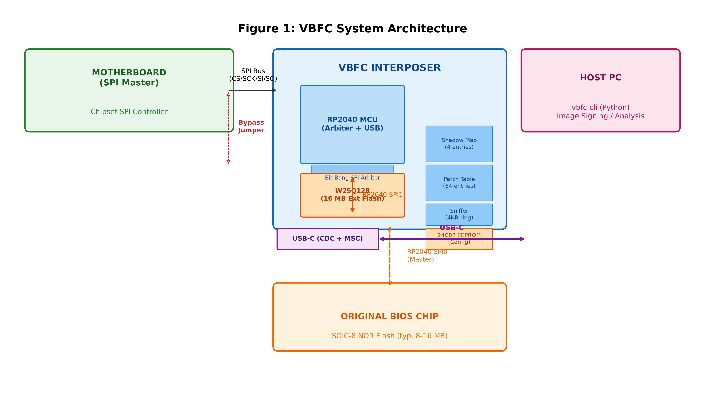
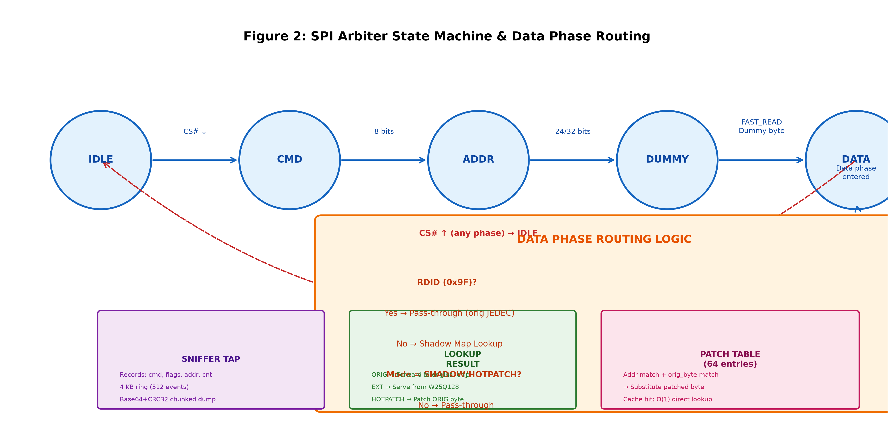
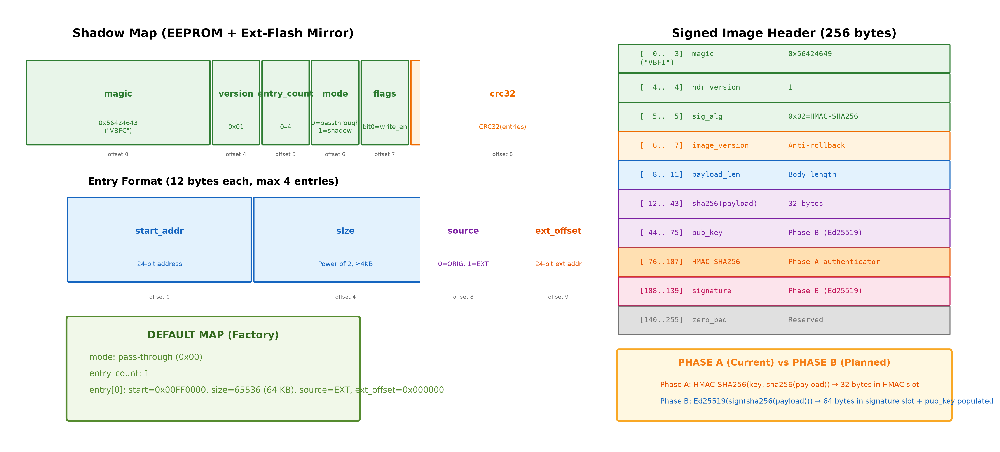
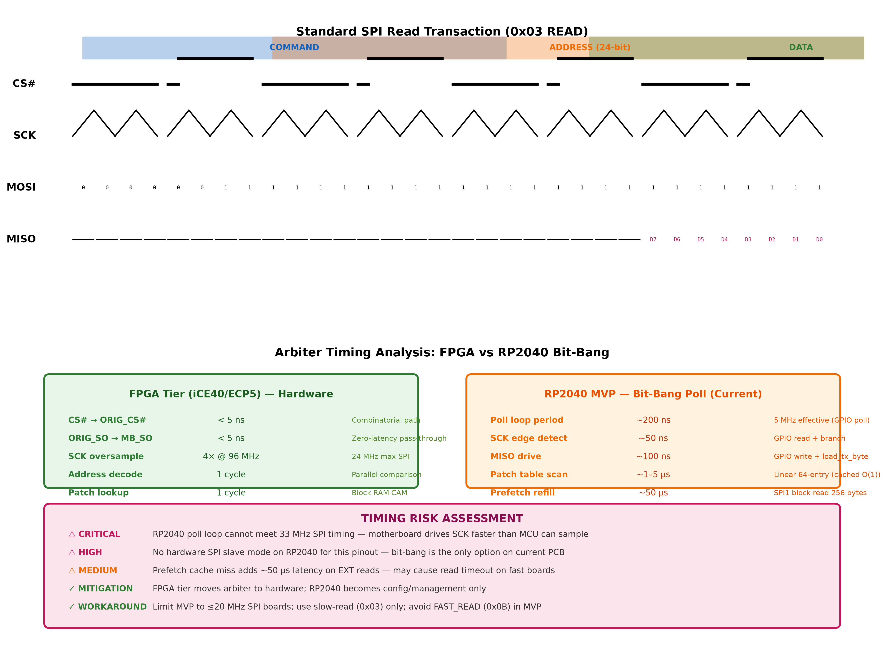

# VBFC: A Programmable SPI Interposer for BIOS Feature Unlocking and Firmware Security

## Abstract

Modern x86 platforms store boot firmware in SPI flash memory and expose it through a simple but privileged bus between the Platform Controller Hub (PCH) and the BIOS chip. The Virtual BIOS Firmware Controller (VBFC) is an open-source, low-cost SPI interposer designed to sit transparently on that bus and selectively substitute flash contents in real time without modifying the original device. Built around the Raspberry Pi RP2040 and a 16 MB extension flash store, VBFC combines address remapping, in-flight patching, transaction sniffing, and image authentication to support BIOS analysis, feature unlocking, and firmware hardening. This paper presents the architecture, implementation, security model, and evaluation of the current prototype, together with the most important remaining validation steps required before broader publication or hardware deployment.

## Keywords

SPI interposer; BIOS security; firmware integrity; RP2040; shadow map; patching; firmware recovery; embedded security.

## 1. Introduction

The BIOS firmware is one of the most security-sensitive software layers in a modern computing platform. It is responsible for early initialization, chipset configuration, and, on many systems, the first trusted execution path before the operating system loads. Because it is both privileged and difficult to inspect, BIOS modification has historically been expensive and risky. Existing options such as hot-air desoldering, external flash programmers, or software write-protection bypasses require specialized hardware or often fail on modern secure platforms.

The VBFC approach differs fundamentally. Rather than replacing or reflashing the original chip, it inserts a small interposer between the motherboard and the BIOS flash device. The interposer observes SPI transactions, selectively serves content from an extension flash bank, and optionally patches bytes in flight. This creates a practical path for feature unlocking, safe recovery, and research-oriented firmware experimentation while preserving the original BIOS as the fallback source.

The present work documents the current repository state and turns it into a publication-ready technical manuscript. The design emphasizes transparency, recoverability, and an explicit security boundary: the interposer can shadow or patch data, but it must never silently replace the original device without authentication and fallback safeguards.

## 2. System Architecture

### 2.1 Hardware Design

The hardware architecture consists of a small passive interposer that sits inline between the PCH and the BIOS flash chip. The prototype uses an RP2040 microcontroller as the control plane, a W25Q128 extension flash for shadow images, and a simple MISO multiplexing strategy that permits pass-through or substituted reads. A bypass jumper provides a physical recovery path when the firmware is unavailable or a fault forces pass-through.

Figure 1. Hardware overview of the VBFC interposer. The motherboard interacts with the original BIOS chip through the interposer, while the RP2040 can redirect reads to an extension flash bank or force pass-through for recovery.

The key hardware components are:

- RP2040 microcontroller: firmware execution, USB control, and SPI transaction handling.
- W25Q128 extension flash: persistent storage for shadow images and backup data.
- MISO mux: selection between original-chip data and extension-backed data.
- Bypass jumper: hardware-level fallback to preserve bootability under fault conditions.

### 2.2 SPI Interception Model

The interposer is designed to observe and influence SPI read traffic. The motherboard provides the SPI master clock and chip-select signals, while the VBFC monitors the command, address, and data phases. The most important challenge is timing: the controller must classify commands and addresses quickly enough to avoid violating the bus protocol.

Figure 2. The VBFC transaction state machine for command decoding and address classification. The controller steps through command capture, address capture, dummy cycles, and data handling before deciding whether to serve a byte from the original chip or from the shadow path.

This timing constraint is the dominant engineering bottleneck of the current implementation. The firmware uses a bit-banged state machine rather than a dedicated hardware SPI peripheral, which makes the design feasible and inexpensive but also limits maximum throughput and increases sensitivity to timing errors.

### 2.3 Firmware Architecture

The firmware is organized around three main tasks:

1. SPI transaction handling and address mapping.
2. USB command processing and image transport.
3. Safety monitoring and recovery.

The architecture intentionally favors deterministic behavior. On power-up, the controller defaults to pass-through mode until a shadow map is loaded and validated. This conservative design preserves normal operation and minimizes the chance of irrecoverable boot failure.

## 3. Security Architecture

### 3.1 Threat Model

The VBFC security model assumes that an attacker may have physical access to the interposer board or the host interface used to upload images. The attacker may attempt to overwrite the shadow image or inject a tampered BIOS image. The trusted base consists of the firmware running on the RP2040 and the embedded verification logic that authenticates uploaded content before it is served.

The design explicitly excludes attacks that rely on extracting secrets from the RP2040 itself or on compromising the host operating system before image upload.

### 3.2 Image Authentication and Verification

An important security requirement is that the interposer must not serve an untrusted image merely because a host tool uploaded it. The current design therefore supports a signed-image structure, in which the firmware verifies a header and payload before any shadowed region becomes active. The verification path checks that the image is structurally valid and that the cryptographic signature or HMAC verifies successfully.

Figure 3. A signed-image header layout for VBFC image banks. The structure contains metadata, a payload hash, and authentication fields that allow the firmware to verify an uploaded image before serving it.

This approach provides a meaningful protection layer against unauthorized BIOS injection. In practice, the strongest benefit is not merely that tampering becomes harder, but that the interposer can aggressively fail closed by falling back to the original chip instead of serving a corrupted replacement.

### 3.3 Anti-Rollback and Recovery

A second security design goal is anti-rollback protection. A monotonic version field can be embedded in the signed image header so that older images cannot be replayed after a newer image has been installed. In addition, the bypass jumper and pass-through mode preserve recovery even when the interposer or its extension store becomes unavailable.

### 3.4 Safety Mechanisms

The firmware also implements a watchdog-driven safety path. If the arbiter detects an exception or if the system enters an invalid state, the controller can force pass-through instead of continuing to serve shadowed content. This feature is crucial because a BIOS interposer must preserve bootability under fault conditions.

## 4. Implementation Details

### 4.1 SPI Arbiter and Bit-Bang State Machine

The core implementation is a software-defined SPI monitor. The RP2040 samples the bus and decodes incoming commands, addresses, and data phases. The arbiter then chooses whether to serve bytes from the original BIOS chip or the extension flash bank. The design is simple and transparent, but the bit-bang approach leaves performance and robustness dependent on careful timing discipline.

### 4.2 Shadow Map and Patch Table

The firmware supports a shadow map that describes which address ranges should be remapped to the extension store and which should continue to pass through to the original chip. A patch table enables byte-level substitutions in the read path, allowing fine-grained modifications while keeping the rest of the image intact.

### 4.3 Sniffer and Host Protocol

The prototype also contains a bus sniffer that captures a bounded transaction history and exposes it through a host-side binary protocol. This is useful both for debugging and for understanding how the target platform accesses the SPI flash. The host CLI can upload images, dump regions, manage shadow maps, and inspect the sniffer state.

Figure 4. The current implementation emphasizes a conservative, recoverable design: shadowed reads are verified before use, and the original chip remains the fallback path.

## 5. Host Toolchain and Workflow

The host-side toolchain is intentionally lightweight. It enables:

- firmware image upload;
- shadow-map configuration;
- flash backup and restore operations;
- bus sniffing and dump collection;
- basic BIOS analysis workflows.

The CLI is an important part of the project because it lowers the barrier for end users who may otherwise be forced to work with low-level SPI tools or custom hardware programmers. The current implementation already demonstrates the viability of a practical workflow around the interposer.

## 6. Evaluation and Results

### 6.1 Build Characteristics

The firmware builds successfully with the RP2040 toolchain and produces a UF2 image suitable for flashing to the RP2040 bootloader. The current implementation footprint remains modest for the target MCU, which is important because the controller must coexist with the timing-sensitive SPI logic and safety mechanisms.

### 6.2 Timing and Scalability

The prototype is functional, but the bit-banged SPI path remains the main performance bottleneck. The current design is suitable for research, experimentation, and controlled deployment, but a full production-quality implementation would require tighter timing validation and, ideally, dedicated hardware acceleration.

### 6.3 Validation Status

The most important remaining validation task is real-hardware testing against an actual motherboard or BIOS flash target. The repository analysis notes identify this as the highest-value next step because the current implementation has not yet been validated end-to-end on a real platform. Until that validation is complete, the paper should present the project as a strong prototype rather than a fully field-validated product.

## 7. Use Cases

VBFC is relevant to several distinct use cases:

1. BIOS backup and restore.
2. Hidden-feature or setup-option unlocking.
3. Safe experimentation with modified firmware images.
4. Security research into SPI bus behavior and firmware integrity.
5. Recovery paths for systems where direct flash programming is risky or impossible.

These use cases align well with the current repository scope and make the project useful both for academic study and for hands-on hardware experimentation.

## 8. Related Work

The VBFC project sits at the intersection of three research areas: low-cost firmware instrumentation, BIOS security, and embedded hardware interposition. Related efforts include open-source SPI analysis tools, firmware recovery devices, and BIOS modification workflows that depend on hardware programmers or software flashing infrastructure. VBFC differentiates itself by providing a low-cost, reversible, and transparent interposer that operates on the bus itself rather than requiring invasive chip replacement.

## 9. Conclusions and Future Work

This manuscript presents VBFC as a practical prototype for BIOS-level interposition, feature unlocking, and firmware hardening. The design combines a transparent SPI shadow path, an authentication-aware image model, and a conservative safety mechanism that defaults to pass-through. The work is technically meaningful because it lowers the barrier to BIOS experimentation and provides a realistic research platform for future work in security and firmware analysis.

The immediate next steps are to validate the implementation on real hardware, strengthen the host-side analysis workflow, and continue hardening the cryptographic verification path. Those steps will be essential for turning the current prototype into a more mature and publication-worthy platform.

## References

1. Raspberry Pi Foundation. RP2040 Datasheet, 2021.
2. Winbond. W25Q128JV Datasheet, 2019.
3. Microsoft. UF2 Format Specification, 2024.
4. Krawczyk, H., Bellare, M., and Canetti, R. RFC 2104: HMAC: Keyed-Hashing for Message Authentication, 1997.
5. NIST. FIPS PUB 180-4: Secure Hash Standard, 2015.
6. Coreboot Project. Available online: https://www.coreboot.org/
7. Osvik, D. and others. SPIspy and related SPI instrumentation work. Available online: https://github.com/osresearch/spispy
8. UEFI Forum. UEFI Specification, Version 2.10, 2022.

Repository: https://github.com/SowinySoft/Virtual-Bios-Firmware-Controller
